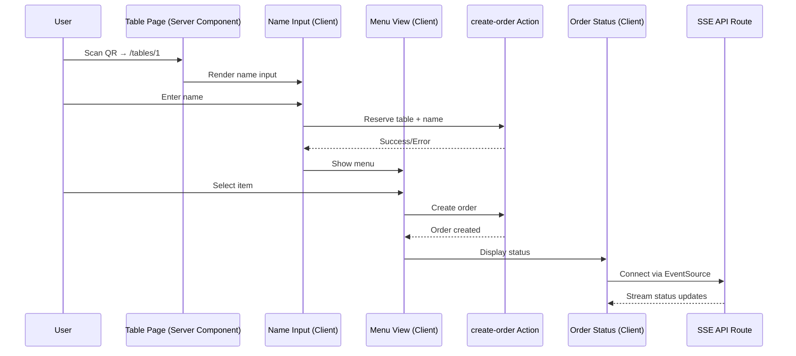

# Guest App Implementation Plan

## Architecture Overview

The app will use Next.js App Router with Server Actions for order management, in-memory state storage, and Server-Sent Events (SSE) for real-time order status updates.

### Data Flow



## File Structure

```
app/
├── page.tsx                    # Root page (optional redirect or landing)
├── layout.tsx                  # Root layout (update metadata)
├── (guest)/
│   └── tables/
│       └── [tableNumber]/
│           └── page.tsx        # Table page (server component) - handles /tables/1, /tables/2, etc.
├── (admin)/
│   └── page.tsx                # Admin page (empty for now) - handles /admin
└── api/
    └── order-status/
        └── route.ts            # SSE API route for real-time order status updates

components/
├── ui/                        # Shadcn UI components (already installed)
│   ├── button.tsx
│   ├── input.tsx
│   ├── card.tsx
│   └── ...                    # Other Shadcn components as needed
├── name-input.tsx             # Client component for name input
├── menu-view.tsx              # Client component for menu display
└── order-status.tsx           # Client component for order tracking

actions/
└── create-order.ts            # Server action: reserve table + create order

lib/
├── store.ts                   # In-memory state management
├── types.ts                   # TypeScript type definitions
└── menu-data.ts               # Mock menu data
```

## Implementation Details

### 1. Type Definitions (`lib/types.ts`)

Located in root `lib/` folder:

Define types for:

- `TableStatus`: "FREE" | "RESERVED"
- `OrderStatus`: "IDLE" | "ORDER_RECEIVED" | "ORDER_PREPARING" | "ORDER_ON_THEY_WAY_TO_TABLE" | "ORDER_SERVED"
- `Table`: `{ status: TableStatus, reservedBy?: string, order?: Order }`
- `Order`: `{ id: string, tableId: number, name: string, item: MenuItem, status: OrderStatus, createdAt: Date }`
- `MenuItem`: `{ id: string, name: string, description: string, price: number, image?: string }`
- `TablesStore`: `Record<number, Table>`

### 2. In-Memory Store (`lib/store.ts`)

Located in root `lib/` folder:

Create a singleton store:

- `tables`: `Record<number, Table>` - stores all table data
- `sseConnections`: `Map<number, ReadableStreamDefaultController[]>` - stores active SSE connections per table
- Helper functions: `getTable()`, `reserveTable()`, `createOrder()`, `updateOrderStatus()`
- SSE helper functions: `addSSEConnection()`, `removeSSEConnection()`, `broadcastToTable()`
- Export store instance for use in Server Actions and API routes

### 3. Server Actions

**`actions/create-order.ts`** (located in root `actions/` folder):

- Accepts: `tableId: number`, `name: string`, `itemId: string`
- Validates table availability (error if already reserved by different name)
- Reserves table with name
- Creates order with status "ORDER_RECEIVED"
- Returns order ID or error

### 4. Mock Menu Data (`lib/menu-data.ts`)

Located in root `lib/` folder:

Create sample menu items with:

- German food items (since status messages are in German)
- id, name, description, price
- 8-12 sample items

### 5. Table Page (`app/(guest)/tables/[tableNumber]/page.tsx`)

Server component that:

- Receives `tableNumber` from dynamic route params (e.g., `/tables/1` → `tableNumber = "1"`)
- Parses `tableNumber` to number and validates it
- Directly fetches initial table/order state from `lib/store.ts` using `getTable(tableNumber)`
- Passes table and order data as props to client components
- Conditionally renders:
  - `name-input` if table not reserved
  - `menu-view` if table reserved but no order
  - `order-status` if order exists
- Handles invalid table number (404 or error message)

### 5a. Admin Page (`app/(admin)/page.tsx`)

Empty page component for now:

- Simple server component that renders an empty div or placeholder
- Will be used later for admin functionality (order management, status updates, etc.)
- Accessible at `/admin` route

### 6. Client Components

**Shadcn UI Components** (imported from `@/components/ui/*`):

- Use Shadcn components for consistent UI:
  - `Button` from `@/components/ui/button` - for action buttons
  - `Input` from `@/components/ui/input` - for form inputs
  - `Card` from `@/components/ui/card` - for menu items and status displays
  - Additional components as needed (e.g., `Badge`, `Alert`, `Skeleton`)

**`components/name-input.tsx`** (located in root `components/` folder):

- Form to input name using Shadcn `Input` component
- Uses Shadcn `Button` for submit action
- Calls `create-order` action to reserve table
- Shows error if table already reserved (using Shadcn `Alert` if available)
- On success, triggers menu display

**`components/menu-view.tsx`** (located in root `components/` folder):

- Displays menu items in mobile-optimized grid/list
- Uses Shadcn `Card` component for each menu item
- Each item shows: image, name, description, price
- Uses Shadcn `Button` for "Order" button per item
- Calls `create-order` action with selected item
- Shows loading/confirmation states (using Shadcn `Skeleton` for loading states)

**`components/order-status.tsx`** (located in root `components/` folder):

- Receives initial order status as prop from server component
- Uses Shadcn `Card` for status display container
- Displays current order status with German messages
- Connects to SSE endpoint (`/api/order-status?tableId=X`) using EventSource API
- Listens for order status updates and updates UI in real-time
- Shows status messages:
  - "6 Minuten. Vor dir sind noch 3 Bestellungen"
  - "Dein Essen ist bald fertig"
  - "Dein Essen ist auf dem Weg"
- Handles connection errors and reconnection logic

### 7. Server-Sent Events (SSE) Implementation

**`app/api/order-status/route.ts`**:

- Accepts `tableId` as query parameter
- Sets up SSE connection with proper headers (`Content-Type: text/event-stream`, `Cache-Control: no-cache`, `Connection: keep-alive`)
- Subscribes to order status changes for the specific table
- Streams order status updates to the client whenever the order status changes
- Uses a simple event emitter pattern or polling mechanism to detect status changes
- Sends events in SSE format: `data: {JSON}\n\n`
- Closes connection when order is served or client disconnects

**Implementation approach**:

- Store active SSE connections mapped by `tableId` in the store
- When order status is updated via `updateOrderStatus()`, broadcast to all connected clients for that table
- Use `ReadableStream` or `Response` with streaming to send SSE events
- Handle client disconnection cleanup

### 8. Mobile Optimization

- Responsive design with Tailwind CSS
- Touch-friendly buttons and inputs
- Mobile-first breakpoints
- Optimized images and loading states
- Viewport meta tag in layout

### 9. Error Handling

- Table already reserved error messages
- Network error handling
- SSE connection failure and reconnection logic
- Invalid table number handling (non-numeric or out of range)
- SSE connection cleanup on component unmount

## Implementation Order

1. Set up types and in-memory store (including SSE connection management)
2. Create mock menu data
3. Implement Server Action (create-order)
4. Create SSE API route (`app/api/order-status/route.ts`)
5. Create table page server component (`app/(guest)/tables/[tableNumber]/page.tsx`) that fetches table/order state directly from store
6. Build name-input component
7. Build menu-view component
8. Build order-status component with SSE EventSource integration
9. Add mobile optimization and styling
10. Test complete user flow

## Dependencies to Add

- No additional dependencies needed - SSE uses native browser EventSource API and Next.js API routes

## Notes

- All state is stored in memory (will be lost on server restart)
- SSE is perfect for this use case since we only need server-to-client updates
- SSE connections are automatically handled by browsers via EventSource API
- German language for status messages as specified
- Single item per order as specified
- Table reservation prevents multiple names per table
- SSE connections are managed per tableId for efficient broadcasting
- QR codes should link to `/tables/<table-number>` format (e.g., `/tables/1`, `/tables/2`)
- Shadcn UI components are already installed and available via `@/components/ui/*` imports
- Use Shadcn components for consistent, accessible UI components (Button, Input, Card, etc.)